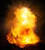

# Whack a Mole Game 

### Description:
Web application game , hit approaching enemy spaceships
#### Pictures:


### Project structure
```
├─ Rocket_Ship
│  ├─ index.html
│  └─ public
│     ├─ css
│     │  ├─ StyleSheet.css
│     │  ├─ font-awesome.min.css
│     │  └─ w3.css
│     ├─ img
│     │  ├─ Fightspace.jpg
│     │  ├─ Space.jpg
│     │  ├─ boom.jpg
│     │  ├─ generalShip.bmp
│     │  ├─ keyboard.png
│     │  ├─ mothership.bmp
│     │  ├─ regship.bmp
│     │  ├─ shipFighter.jpg
│     │  └─ spaceship.png
│     ├─ js
│     │  ├─ app.js
│     │  ├─ jquery.color-2.1.2.min.js
│     │  └─ jquery.min.js
│     └─ sound
│        ├─ Explosion.mp3
│        ├─ SpaceLaserShot.mp3
│        └─ spaceGameLoop_mp3.mp3
```
index.html
```html
<!DOCTYPE html>
<html>
    <head>
        <meta charset="utf-8" />
        <script src="./public/js/jquery.min.js"></script>
        <link href="./public/css/StyleSheet.css" rel="stylesheet" />
        <script src="./public/js/app.js"></script> 
    </head>

    <body background="./public/img/Space.jpg" dir="rtl">
    
        <div class="container">

            <div class="section">
                <h2 style="color:goldenrod;">הוראות משחק</h2>
                
                
                <p style="color:goldenrod;">קרב ספינות בחלל עליך לפגוע בחלליות איוב , ישנם שלושה סוגים של חלליות וללכל אחת ניקוד שונה , המספר המרבי של נקודות הינו 100 </p>
                <h3 style="color:goldenrod;">:מקשי מקלדת</h3>
                <ul style="color:goldenrod;">
                    <li>לחץ ימינה : ספינת קר זזה ימינה </li>
                    <li>לחץ שמאל : ספינת קר זזה שמאלה</li>
                    <li>לחץ למעלה : ספינת קרב יורה</li>
                  </ul>

            </div>

            <div class="section"> 
                <div><h1 id="header" style="color:rgba(10, 235, 47, 0.747); text-align: center;">מלחמת כוכבים</h1> <br></div> 

                <div class="screen">
                    <div id="spaceShip"></div>
                    <div class="shooter">  </div>
                    <div class="bullet"></div>
                </div>

                <div class="div_button"> <div class="center"><input class="button" onclick="start()" type="button" value="שחק !" /></div> </div> 
                <!--Game table result-->
                <table class="table-result">
                    <tr>
                        <th>חלליות</th>
                        <th> חללית אויב </th>
                        <th> חללית מפקד </th>
                        <th>   ספינת אם </th>
                        <th> סהכ התוצאות </th>
                    </tr>
                    <tr>
                        <th> נקודות </th>
                        <th id="regular">0</th>
                        <th id="general">0</th>
                        <th id="mother">0</th>
                        <th id="total">0</th>
                    </tr>
                    <tr>
                        <th> מס' החלליות/פגיעות </th>
                        <th id="shipHit">0/0</th>
                        <th id="generalHit">0/0</th>
                        <th id="motherHit">0/0</th>
                        <th id="totalShips">0/0</th>
                    </tr>
                </table>
            </div>

            <div class="section">
                
            </div>
     
        </div>
    </body>
</html>

```
styleSheet.css
```css
#header{
    color:lightgrey;
}

.container {
    display: flex;

  }
  .section {
    width: 100%;
    padding: 5px;
   
    justify-content: center;
    
  }

.screen {
    width: 320px;
    height: 500px;
    background-color: black;
    padding: 50px;
    margin: auto;
    position: relative;
    background-image: url('../img/Fightspace.jpg');
    box-shadow: 5px 0px 50px 50px black;

}

.table-result{
    background-color:white;
    margin: auto;
    position: relative;
    box-shadow: 0px 0px 10px 5px white;
    border: 3px black;
    opacity: 0.6;

}
.table-result, th, td {
    border: 1px solid black;
  }

#spaceShip{
      width:15px;
      height:15px;
      position:absolute;
      left:300px;      
      top:0px;
      background-color:black;
      opacity:0;
}
.shooter{
     width:50px;
     height:40px;
     top:550px;
     left:175px;
     position:absolute;      
}
.bullet{
     width:5px;
     height:40px;
     background-color:pink; 
     top:600px;
     left:195px;
     border-radius:40%;
     position:absolute;
     opacity:0;      
}

.button {
  background-color: #c2fbd7;
  border-radius: 100px;
  box-shadow: rgba(44, 187, 99, .2) 0 -25px 18px -14px inset,rgba(44, 187, 99, .15) 0 1px 2px,rgba(44, 187, 99, .15) 0 2px 4px,rgba(44, 187, 99, .15) 0 4px 8px,rgba(44, 187, 99, .15) 0 8px 16px,rgba(44, 187, 99, .15) 0 16px 32px;
  color: green;
  cursor: pointer;
  display: inline-block;
  font-family: CerebriSans-Regular,-apple-system,system-ui,Roboto,sans-serif;
  padding: 7px 20px;
  text-align: center;
  text-decoration: none;
  transition: all 250ms;
  border: 0;
  font-size: 16px;
  user-select: none;
  -webkit-user-select: none;
  touch-action: manipulation;
}

.button:hover {
  box-shadow: rgba(44,187,99,.35) 0 -25px 18px -14px inset,rgba(44,187,99,.25) 0 1px 2px,rgba(44,187,99,.25) 0 2px 4px,rgba(44,187,99,.25) 0 4px 8px,rgba(44,187,99,.25) 0 8px 16px,rgba(44,187,99,.25) 0 16px 32px;
  transform: scale(1.05) rotate(-1deg);
}
.div_button{
height: 70px;
position: relative;
}
.center {
    margin: 0;
    position: absolute;
    top: 50%;
    left: 50%;
    -ms-transform: translate(-50%, -50%);
    transform: translate(-50%, -50%);
  }
```

app.js 
```js
//starting the program and send enemy attack
function run() {
    shipType();

        $("#spaceShip").animate({
            top: 520,
            backgroundColor: "black",
            opacity:1
             
        }, {
            duration: 3500,
            progress: function (o, p, t) { compareForStop(); },

            easing: "linear",
            complete: function () { $("#spaceShip").css({"background-color":"black",top:0 + "px",opacity:0}) }
        });
    
}
//choose the position of war ships enemy
function shipPosition() {
    placeShip = Math.round(35 + Math.random() * 300);
    $("#spaceShip").css({ left: placeShip +"px"})
}

//count ships
var regularShip = 0;
var generalShip = 0;
var motherShip = 0;
var totalShip = 0;

//hit count
var hitRegularShip = 0;
var hitGeneralShip = 0;
var hitMotherShip = 0;
var totalHit = 0;


//select ship enemy type regular/generals/motherboard
var ship = 0;
function shipType()
{
    ship = Math.round(Math.random()* 100);
    if (ship <= 70) {
        $("#spaceShip").css({ "width": "15px", "height": "15px" })//create regular
        $("#spaceShip").html('');

        regularShip = (regularShip + 1);
        document.getElementById("shipHit").innerHTML = hitRegularShip + "/" + regularShip;
        totalShip = (totalShip + 1);
        document.getElementById("totalShips").innerHTML = totalHit + "/" + totalShip;
    }
    if (ship > 70 && ship <= 90) {
        $("#spaceShip").css({ "width": "25px", "height": "25px" })// create generals
        $("#spaceShip").html('');

        generalShip = (generalShip + 1);
        document.getElementById("generalHit").innerHTML = hitGeneralShip + "/" + generalShip;
        totalShip = (totalShip + 1);
        document.getElementById("totalShips").innerHTML = totalHit + "/" + totalShip;
    }
    if (ship > 90) {
        $("#spaceShip").css({ "width": "40px", "height": "40px" })//create motherboard
        $("#spaceShip").html('');

        motherShip = (motherShip + 1);
        document.getElementById("motherHit").innerHTML = hitMotherShip + "/" + motherShip;
        totalShip = (totalShip + 1);
        document.getElementById("totalShips").innerHTML = totalHit + "/" + totalShip;


    }
    shipPosition();

}

//click start to play
function start() {
    //changing game instruction
    $("#header").html("השתמש בחצים כדי לזוז ולירות").css('color' , 'yellow');
   
    //start and loop background music
    myAudio = new Audio('./public/sound/spaceGameLoop_mp3.mp3'); 
    if (typeof myAudio.loop == 'boolean')
    {
        myAudio.loop = true;
    }
    else
    {
        myAudio.addEventListener('ended', function() {
            this.currentTime = 0;
            this.play();
        }, false);
    }
    myAudio.play();

    //changing game instruction

    setTimeout(()=>{
        $("#header").html("הזהר האויב כבר כאן, התחל לירות!").css('color' , 'red');

    },3000)

    //start space ship attack
    setInterval(run, 4000);
}

//take a fire
var upKey = 38;
var stopMoveFire = 8; //start move again
function fire() {

    var audio = new Audio('./public/sound/SpaceLaserShot.mp3');
    audio.play();
   
    $(".bullet").animate({
        top: 0,
        backgroundColor: "pink",
        opacity:1


    }, {
        duration: 500,
        progress: function (o, p, t) { compareForStop();},

        easing: "linear",

        complete: function () {
            var position = parseInt($('.shooter').css('left'))+20;
            $(".bullet").css({ "background-color": "pink", top: 620 + "px", left: position + "px", opacity:0 })
            stopMoveFire = 8;// start move with the shooter
            upKey = 38; // return the option to shoot;
        }
        

    })

}
var la = document.getElementById("laser");

//stick or control arrows keyboard events 
document.onkeydown = function (event) {
    //right arrow
    if (event.keyCode == 37) {
        var rightArrow = parseInt($('.shooter').css('left'));
        if (rightArrow > 0) {
            $(".shooter").css({ left: "-="+8 })
            $(".bullet").css({ left: "-=" + stopMoveFire })
        }
    }
    //left arrow
    if (event.keyCode == 39) {

        var leftArrow = parseInt($('.shooter').css('left'));
        if (leftArrow < 350) {
            $(".shooter").css({ left: "+="+8 })
            $(".bullet").css({ left: "+=" + stopMoveFire })

        }
    }
    //up arrow
    if (event.keyCode == upKey) {
        upKey = 0; //stop the shooting until the animation complete
        stopMoveFire = 0;// when we take fire stop the bullet from move right or left
        fire();
    }

}
var pointShip = 0;
var pointGeneral = 0;
var pointMother = 0;

//check if we got hit & count hit point
function compareForStop() {
    var ship = parseFloat($("#spaceShip").css("top"));// getting the top position
    var fire = parseFloat($(".bullet").css("top"));
    var ship1 = parseFloat($("#spaceShip").css("left"));
    var fire1 = parseFloat($(".bullet").css("left"));


    if (Math.abs(ship - fire) < 20 && Math.abs(ship1 - fire1) < 20) {// check if they in the same area
        $("#spaceShip").html('');
     
        setTimeout(()=>{
         $("#spaceShip").css({ "background-color": "black", top: 0 + "px", opacity:0 }).stop();

        },200)
       
        $(".bullet").css({ "background-color": "black", top: 0 + "px", opacity: 0 });

        

       
        var audio = new Audio('./public/sound/Explosion.mp3');
        audio.play();   

        if (parseFloat($("#spaceShip").css("width")) == 15) {
            pointShip = pointShip + 2;
            document.getElementById("regular").innerHTML = pointShip;
            $("#spaceShip").css("width", 16)
            document.getElementById("total").innerHTML = pointShip + pointGeneral + pointMother;

            hitRegularShip = (hitRegularShip + 1);
            document.getElementById("shipHit").innerHTML = hitRegularShip + "/" + regularShip;
            totalHit = (totalHit + 1);
            document.getElementById("totalShips").innerHTML = totalHit + "/" + totalShip;

            

        }
        if (parseFloat($("#spaceShip").css("width")) == 25) {
            pointGeneral = pointGeneral + 5;
            document.getElementById("general").innerHTML = pointGeneral;
            $("#spaceShip").css("width", 26)
            document.getElementById("total").innerHTML = pointShip + pointGeneral + pointMother;

            hitGeneralShip = (hitGeneralShip + 1);
            document.getElementById("generalHit").innerHTML = hitGeneralShip + "/" + generalShip;
            totalHit = (totalHit + 1);
            document.getElementById("totalShips").innerHTML = totalHit + "/" + totalShip;

     
        }
        if (parseFloat($("#spaceShip").css("width")) == 40) {
            pointMother = pointMother + 10;
            document.getElementById("mother").innerHTML = pointMother;
            $("#spaceShip").css("width", 41)
            document.getElementById("total").innerHTML = pointShip + pointGeneral + pointMother;

            hitMotherShip = (hitMotherShip + 1);
            document.getElementById("motherHit").innerHTML = hitMotherShip + "/" + motherShip;
            totalHit = (totalHit + 1);
            document.getElementById("totalShips").innerHTML = totalHit + "/" + totalShip;


        }

        // 100 point and reload the page
        var totalFinishGame = document.getElementById("total").innerHTML;
        if (totalFinishGame > 100) {
            alert("Well done, you've reached 100 points!")
            window.location.reload();
        }


    }

}

//this game made by erez Asmara
```